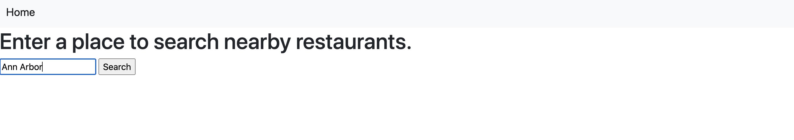
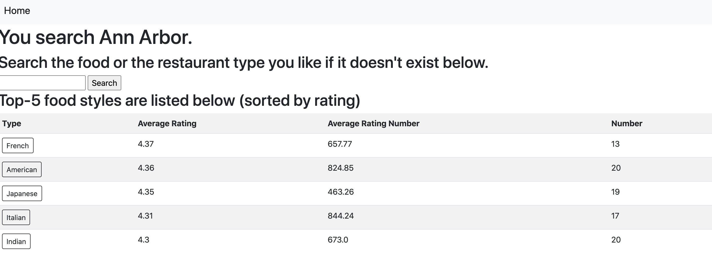
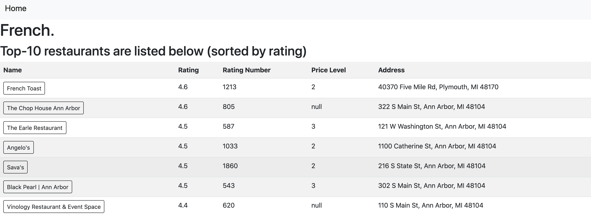
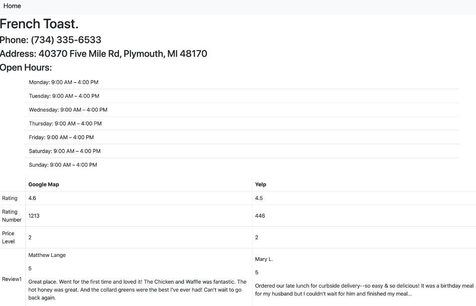

# Find nearby food
SI 507 Final Project, Winter 2021, UMich.

## Installation
Create a virtual enviroment of python3 (3.8.6)
```
python3 -m venv YOUR_VENV
```
Activate the virtual enviroment
```
source YOUR_VENV/bin/activate
```
Install the requirement packages by pip
* Flask==1.1.2
* Jinja2==2.11.3
* requests==2.25.1
* yelpapi==2.4.0
```
pip install -r requirements.txt
```
## Preparation
### Google Map
1. Create an account on [Google Cloud Platform](https://console.cloud.google.com/getting-started)
2. Activate the service of [Place API](https://developers.google.com/maps/documentation/places/web-service/overview).
3. Create a project and get the API key.

### Yelp
1. Create an account on [Yelp](https://www.yelp.com/developers/documentation/v3).
2. Create a new project.
3. Get the API key.

Store the API keys in `secrets.py` as
```
GOOGLE_API_KEY = "YOUR_GOOGLE_API_KEY_HERE"
YELP_CLIENT_ID = "YOUR_YELP_CLIENT_ID_HERE"
YELP_API_KEY = "YOUR_YELP_API_KEY_HERE"
```

## Used requests
### Google Map
* [Place Search Requests](https://developers.google.com/maps/documentation/places/web-service/search): Request information of the given place name, location, or place_id.
    * [Find Place Requests](https://developers.google.com/maps/documentation/places/web-service/search#FindPlaceRequests)
    * [Nearby Search Requests](https://developers.google.com/maps/documentation/places/web-service/search#PlaceSearchRequests)
    * [Text Search Requests](https://developers.google.com/maps/documentation/places/web-service/search#TextSearchRequests)
* [Place Details Requests](https://developers.google.com/maps/documentation/places/web-service/details): Request detailed information of the given place_id, where we can get place_id vid **Place Search Requests**.
### Yelp
* [Phone Search Requests](https://www.yelp.com/developers/documentation/v3/business_search_phone): Use phone number to request information.
* [Reviews ID Requests](https://www.yelp.com/developers/documentation/v3/business_reviews): Use ID to request information of reviews, which we can get ID from **Phone Search Requests**.
* Note: Since I didn't find Yelp official API for python, I use custom-defined API [here](https://github.com/gfairchild/yelpapi).

## Interaction
1. Enter `python app.py` in your terminal (or cmd), then this will launch a local server on http://127.0.0.1:5000/. Enter this into your browser to view the website.
2. You will see this page, letting you enter a place you want to search nearby restaurants (e.g., Ann Arbor).

3. The program will list top-5 food styles and top-5 food types near this place (sorted by average of rating). User can choose predefined one or enter other restaurant type.

4. The program will list top-10 restaurants below with some of their information, such as rating.

5. Choose one to realize more detailed information about the restaurant as below.


Note: User can click the **Home** button on the top to search another place no matter when.

## TODO
1. Add class of restaurants and details to process the data as this form instead of a list.
2. Revise `app.py`.
3. Add some figures for results, such as radar plots.
4. Embed the Google Map in website to see where the restaurants are through latitude and longitude.